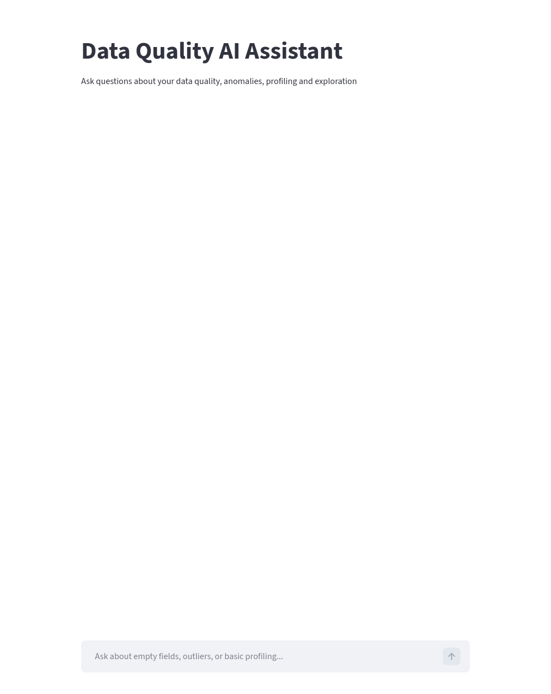
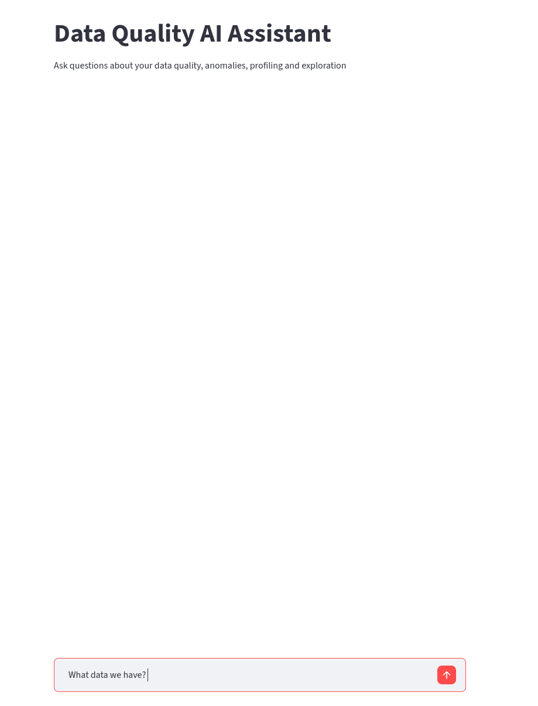
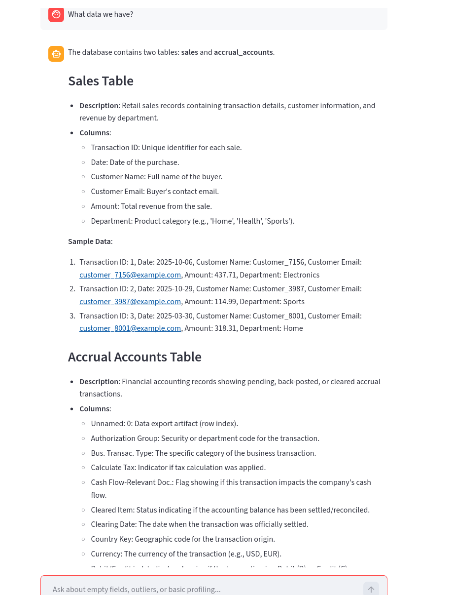

# ai-data-analyst
[video walkthrough](https://youtu.be/4Hol6ctwp8E)

[1. How to run](#1-how-to-run)  
[2. What I built and why](#2-what-i-built-and-why)  
[3. What I chose not to do](#3-what-i-chose-not-to-do)  
[4. How my approach evolved](#4-how-my-approach-evolved)

## 1. How to run
1. Clone the repository and open project directory.
2. Create python virtual environment and activate it: 
    ```bash
    #win
   python -m venv venv
   venv\Scripts\activate

   #mac/linux
   python3 -m venv venv
   source venv/bin/activate
    ```
3. Install dependencies:
    ```bash
    pip install -r requirements.txt
    ```
4. Setup environment variables:
   - create .env
   - enter your OpenAI API key (in this step it works only with **gpt-4o-mini**)
   - enter your database url (in this step project works with **sqlite**)
5. Init database(excel table must be in working directory):
    ```bash
    #win
    python init_db.py
   
    #mac/linux
    python3 init_db.py
    ```
6. Run Streamlit app:
    ```bash
    streamlit run app.py
   ```
## 2. What I built and why
I have created a service, which allows non-technical users to do **text-to-sql** requests 
with the help of an AI agent.

Here is pretty simple web interface, through which we can make our requests in chat form.

User writes request, as example 
```
What data we have?
```


User sends his request, and receives response from agent




## 3. What I chose not to do
First thing is data modification, due to potential hallucinations, it is
not safe to give agent access to make some changes in data

Second is Vector db and RAG for schema detection.
I created `init_db.py` which transforms Excel tables into SQL, also this script 
creates database table `sales`, which I created for some test.
As this is PoC, and there are only two tables, I don't think that RAG will give some
advantage, in this case implementing that would be over-engineering

Also, I have decided to make more text outputs, it means that model doesn't know how to
visualize data, in cause of complexity and limitations of used model

If I had more time, the next thing I would add is data visualization, cause it is 
important thing in data analysis, but first is actually to change model from mini :)

## 4. How my approach evolved

The first thing I did was open an LLM(Gemini) and ask, how works SQL AI Agents, I start some brainstorm, 
how it must solve our stakeholders problem, and how to implement it with given materials(test data and given model)

First implementation, was model what works with system instruction, however
testing revealed 'prompt-fragility', with new iteration of simple tests, prompt continued to grow.
So, I decided to change direction, and again go to LLM, describe my problem, resources and limitations, and 
get helpful advice, to make it not with big prompt, but with Semantic Layer.
I ask to create `metadata.json` and implemented new solution, also in new version I added some context memory for
better responses.

